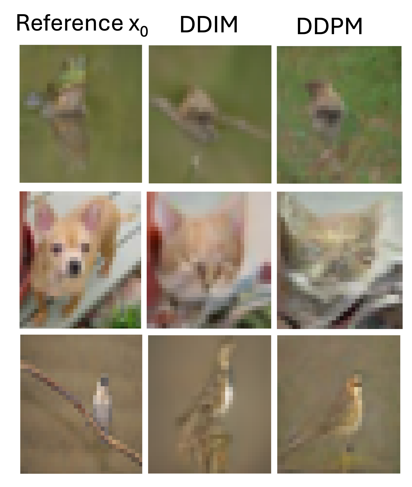
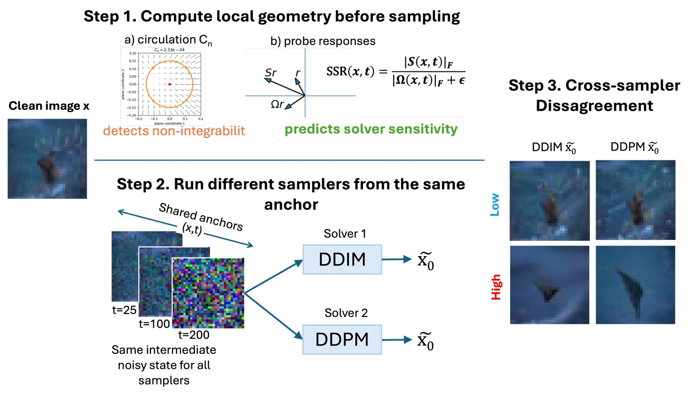

# Figure 1 

# Main paper schematic

**Figure** Illustration of the main experimental pipeline. At a shared anchor $(x_t,t)$, computed before sampling, we evaluate two local geometry diagnostics: circulation $C_n$, which tests local path dependence / non-integrability, and the strain-to-spin ratio $\mathrm{SSR}(x,t)=\|S(x,t)\|_F/(\|\Omega(x,t)\|_F+\epsilon)$, which is evaluated as a predictor of downstream solver disagreement. We then run different samplers from the same anchor and measure the resulting cross-sampler semantic disagreement between the reconstructed outputs.
